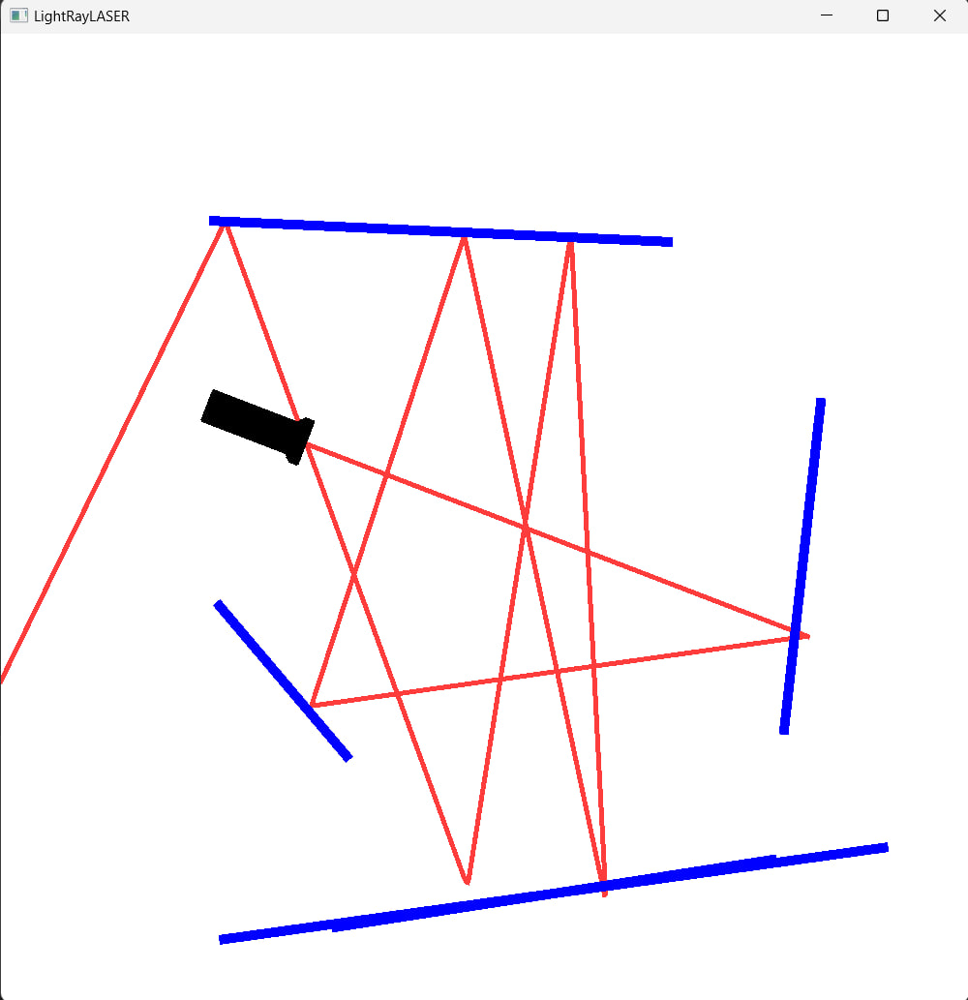

# mirrors_and_lasers_simulation
This program simulate physic activity between lasers and mirrors.

To place the mirror hold the `left click` and after that move your cursor to give your object a rotation and size. 

To move your flashlight press `right click`, to rotate anti-clockwise press the `up arrow`, to counterclockwise press the `down arrow`.

## Example

 
